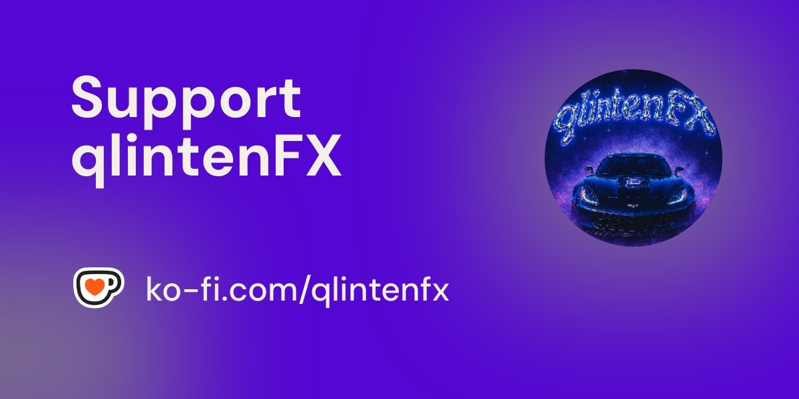

# KeyedColors

A simple Windows application that allows users to create custom display profiles with gamma and contrast adjustments. Each profile can be assigned a custom hotkey for quick access.

## Features

- Create and manage multiple display profiles
- Adjust gamma and contrast settings
- Assign custom hotkeys to profiles for quick access
- System tray integration for easy access
- Profiles are saved automatically and persist between sessions
- Comes with three default presets:
  - **Default**: Standard display (Gamma: 1.0, Contrast: 50%)
  - **Dark**: Reduced brightness for low-light environments (Gamma: 0.8, Contrast: 50%)
  - **Night Vision**: Enhanced visibility in dark environments (Gamma: 2.8, Contrast: 60%)

## Usage

1. **Create a Profile**:
   - Adjust the gamma and contrast sliders to your preferred settings
   - Click "Add" to create a new profile
   - Enter a name for the profile

2. **Manage Profiles**:
   - Select a profile from the list to activate it
   - Click "Update" to save changes to an existing profile
   - Click "Del" to delete a profile

3. **Set Hotkeys**:
   - Select a profile
   - Click "Set Hotkey"
   - Press a key combination (e.g., Ctrl+Alt+1)
   - Click OK to save the hotkey

4. **System Tray**:
   - The application minimizes to the system tray when closed
   - Double-click the tray icon to restore the window
   - Right-click the tray icon for a menu of profiles and options

## Requirements

- Windows 10 or later
- .NET 6.0 Runtime or later

## Building from Source

1. Clone the repository
2. Open the solution in Visual Studio 2022 or later
3. Build the solution
4. Run the application

## License

This software is licensed under the GNU General Public License v3.0 (GPL-3.0). See the LICENSE file for details.

Copyright © 2025 qlintenFX

## Support Development

If you find KeyedColors useful, please consider supporting its development through a donation. This helps maintain the project and add new features.

## Contributing

Contributions are welcome! See the [CONTRIBUTING.md](CONTRIBUTING.md) file for guidelines.

## Acknowledgments

- This application uses Windows API for display settings manipulation 